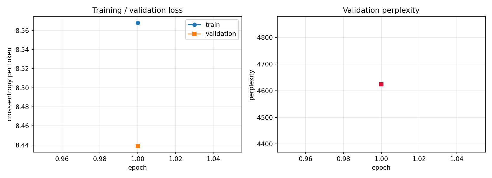
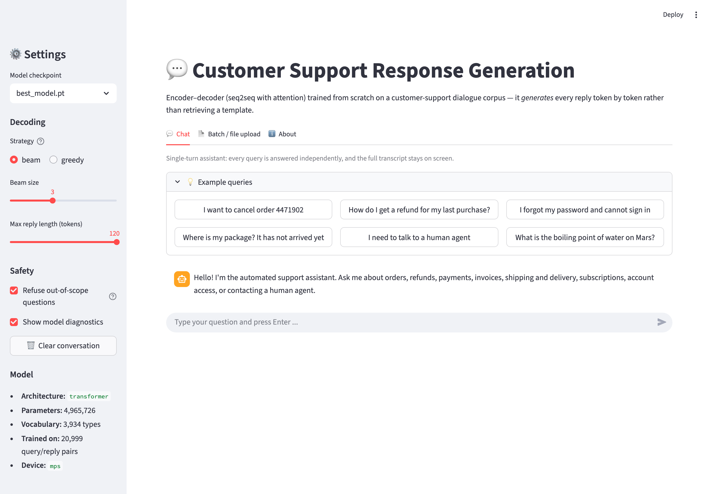
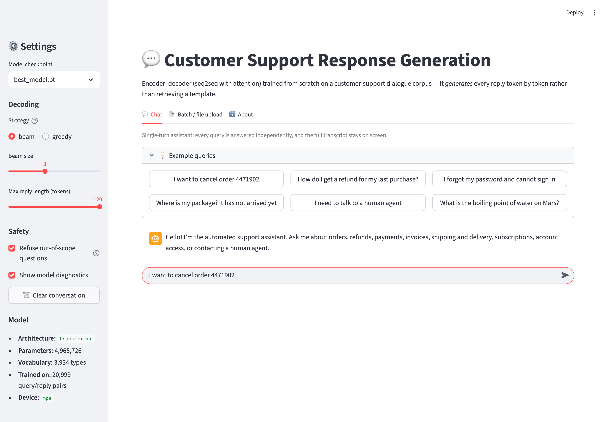
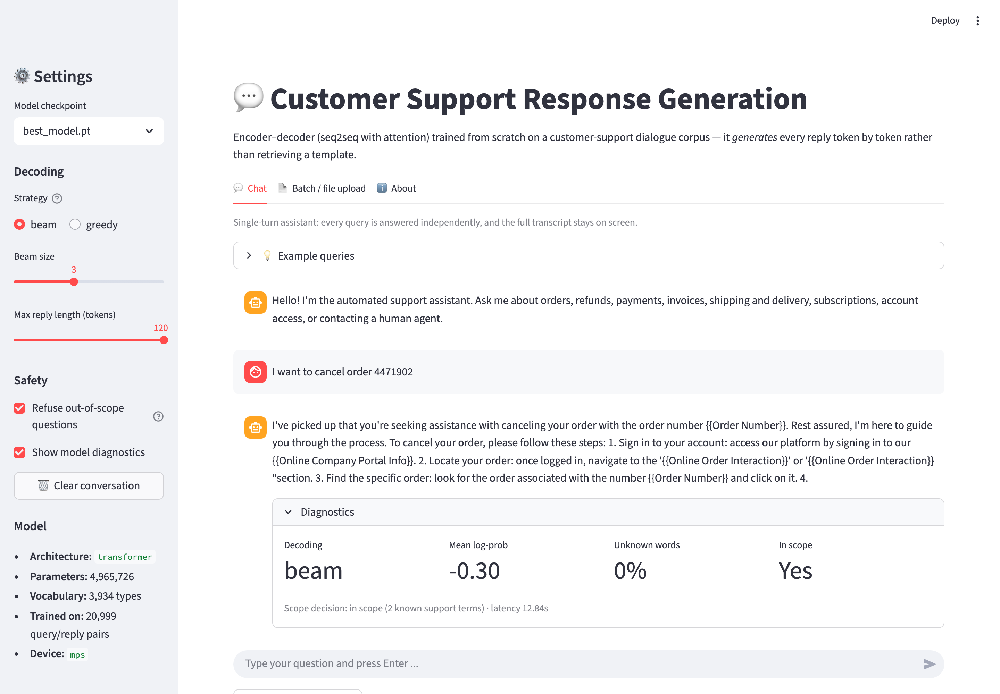
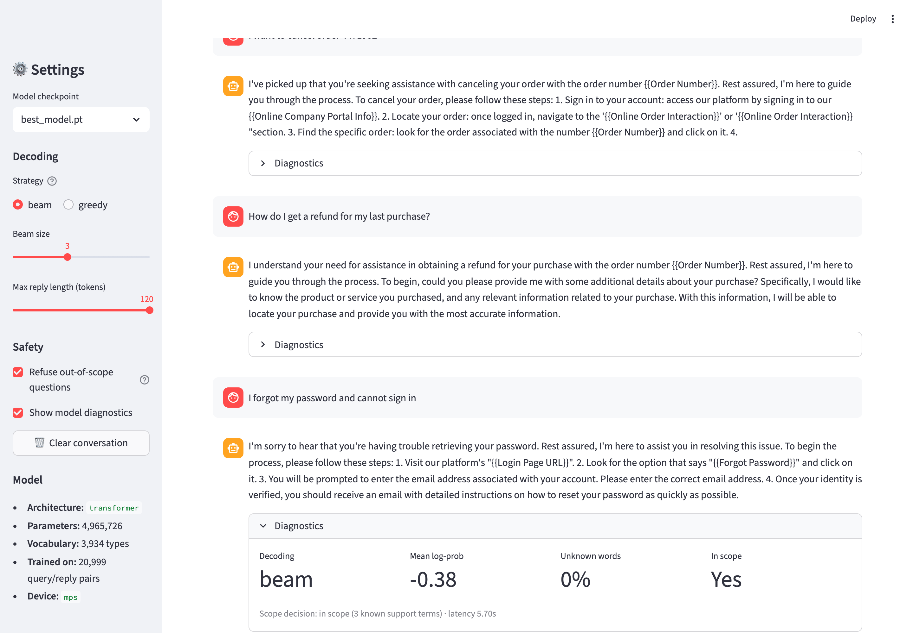
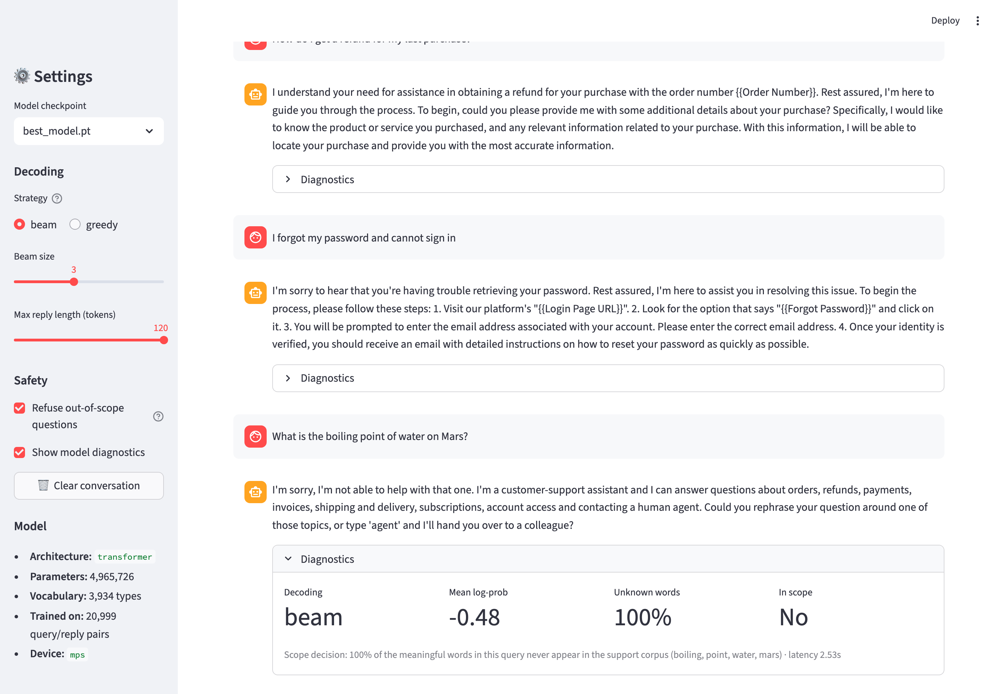
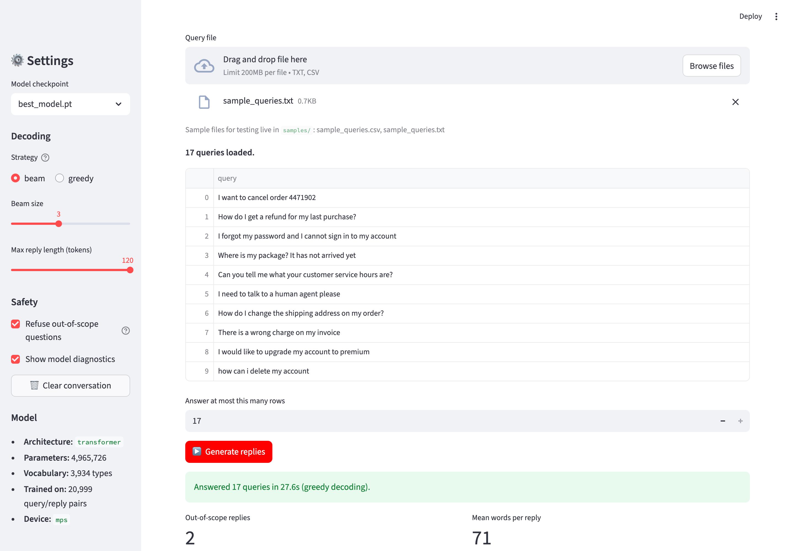
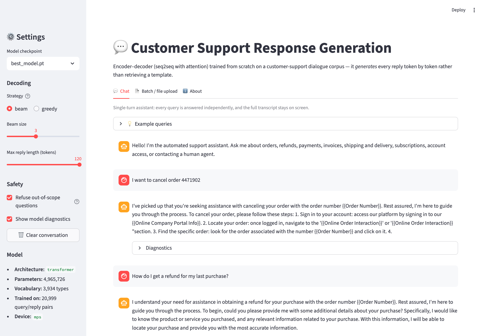

# Customer Support Response Generation Chatbot

**M.Tech. AIML — Natural Language Processing (S2-25_AIMLCZG530)**
**Assignment 2 · GS-3 · Group 1**

| Name | BITS ID | Contribution |
|---|---|---|
| _[member 1 — fill in]_ | _[2xxxxxxxx]_ | 25% |
| _[member 2 — fill in]_ | _[2xxxxxxxx]_ | 25% |
| _[member 3 — fill in]_ | _[2xxxxxxxx]_ | 25% |
| _[member 4 — fill in]_ | _[2xxxxxxxx]_ | 25% |

---

## Table of contents

1. Problem analysis
2. Data collection and preprocessing
3. Model development
4. Application development (with screenshots)
5. Evaluation and demonstration
6. Observations, conclusion and references

---

# 1. Problem Analysis

## 1.1 Application domain and business processes

The domain is **customer support / service operations** for a consumer-facing
retail or subscription business. Support desks receive a high volume of
repetitive contacts, and an agent spends most of a shift re-typing near-identical
replies. The application is an **agent-assist response drafter**: it reads a
customer query and drafts the reply an agent would have typed.

The business processes covered are:

| Business process | Typical query | Where the draft helps |
|---|---|---|
| Order management | *"I want to cancel order 4471902"* | first response, order-change acknowledgement |
| Returns and refunds | *"How do I get a refund?"* | refund-policy explanation, status updates |
| Billing and invoicing | *"There is a wrong charge on my invoice"* | invoice retrieval, dispute intake |
| Payments | *"What payment methods do you accept?"* | payment FAQ, failed-payment guidance |
| Shipping and delivery | *"Where is my package?"* | tracking guidance, delivery windows |
| Account access | *"I forgot my password"* | recovery walk-through |
| Subscription management | *"Upgrade my account to premium"* | plan-change instructions |
| Contact and escalation | *"I need a human agent"* | routing and hand-off |
| Feedback and complaints | *"I want to leave feedback"* | acknowledgement and routing |

Business value: lower average handling time, consistent tone, faster first
response and lower cost per ticket. The agent stays in the loop — the model
drafts, a human approves.

## 1.2 Problem statement and functional requirements

> **Problem statement.** Given a free-text customer support query, automatically
> generate a fluent, contextually relevant support reply using an
> encoder–decoder neural network, rather than selecting a fixed template.

| # | Functional requirement |
|---|---|
| FR-1 | Accept a free-text query typed into a chat box. |
| FR-2 | Accept a `.txt` (one query per line) or `.csv` (a query column) upload and answer every row. |
| FR-3 | Generate the reply token by token with a trained encoder–decoder; no retrieval, no template lookup. |
| FR-4 | Support greedy **and** beam-search decoding, selectable at run time. |
| FR-5 | Display the reply in a chat interface and retain the full transcript on screen. |
| FR-6 | Detect out-of-scope queries and return a hand-off message instead of an invented answer. |
| FR-7 | Expose per-reply diagnostics (confidence, unknown-word ratio, scope decision, latency). |
| FR-8 | Allow the transcript and the batch results to be downloaded. |

**Non-functional requirements.** A reply in under ~3 s on CPU; the app runs
locally with a single command; the model stays under 10 M parameters so it
trains on a laptop; preprocessing is deterministic under a fixed seed.

**Behaviour when the query is out of scope (FR-6).** A query is refused when
*either*

* more than **50%** of its *content* words (non-stopword, longer than
  two characters) never occur in the **queries** of the training split, or
* the decoder's mean per-token log-probability falls below **-1.5**.

The user then receives a message naming the topics the assistant can handle and
offering a hand-off to a human agent. This is deliberately conservative: in
customer communication a confident wrong answer costs more than an admission of
ignorance.

## 1.3 Expected input and output

| | |
|---|---|
| **Input** | One customer query as free text (chat box), or a `.txt` / `.csv` file of queries (batch mode). |
| **Output** | A generated support reply of roughly 40–120 words, rendered with readable `{{Placeholders}}` (for example `{{Order Number}}`) that a human agent fills in, plus a scope flag and a confidence score. Batch mode returns a downloadable CSV. |
| **Conversation type** | **Single-turn.** Each query is encoded and answered independently. The transcript is retained and displayed on screen, but earlier turns are not fed back into the encoder. |

Multi-turn support would require the corpus to be re-flattened with dialogue
history concatenated into the source sequence. The architecture supports it; the
chosen corpus does not carry the history.

---

# 2. Data Collection and Preprocessing

## 2.1 Dataset

| | |
|---|---|
| **Name** | Bitext — Customer Service Tagged Training Dataset for LLM-based Virtual Assistants |
| **Source** | https://huggingface.co/datasets/bitext/Bitext-customer-support-llm-chatbot-training-dataset |
| **Licence** | Community Data License Agreement — Sharing, v1.0 (**CDLA-Sharing-1.0**) |
| **Size** | **26,872** query–response pairs · 18 MB · one CSV file |
| **Structure** | `instruction` (customer message), `response` (agent reply), plus `category`, `intent` and `flags` metadata |
| **Coverage** | 11 categories (ORDER, REFUND, ACCOUNT, PAYMENT, INVOICE, SHIPPING, DELIVERY, SUBSCRIPTION, CANCEL, CONTACT, FEEDBACK) and 27 intents |
| **Message length** | queries 1–16 words (mean 8.7); replies 9–402 words (mean 105) |

This matches the dataset description in the problem statement: a dialogue corpus
of query–response pairs in the 10 k–1 L range, drawn from customer-support chat
logs, with optional intent metadata.

## 2.2 Preprocessing pipeline

Implemented in `src/preprocess.py` and reproducible with `python src/preprocess.py`.

1. **Placeholder normalisation.** The corpus marks variable data as
   `{{Order Number}}`, `{{Account Type}}`, … Left alone the braces would be
   shredded by tokenisation. Each of the **43** frequent slots
   becomes a single vocabulary token (`<ph_order_number>`); the long tail
   collapses into `<ph_details>`. The map is saved so replies can be rendered
   back with readable placeholders.
2. **Cleaning.** HTML tags, URLs (`<url>`), e-mail addresses (`<email>`),
   `@usernames` (`<user>`), hashtags, emoji and zero-width characters are removed
   or replaced; curly quotes and dashes are normalised; runs of repeated
   characters (`heyyyy`) and punctuation (`???`) are collapsed; text is
   lower-cased.
3. **Chat-speak normalisation** (query side): `u → you`, `pls → please`,
   `asap → as soon as possible`, `recieve → receive`, and 60 further entries.
4. **Reference-number slotting** (query side): a live query such as *"where is my
   order 4471902"* maps the digit run onto the slot implied by the surrounding
   words, so real customer input does not become an unknown token.
5. **Automated and duplicate removal.** Regex filters for auto-replies
   ("this is an automated message", "do not reply", out-of-office notices);
   **0** exact duplicate pairs and
   **5** degenerate rows removed; at most four replies kept per
   distinct query, which dropped a further **600** rows so
   that frequent intents do not dominate the loss.
6. **Tokenisation** with a regex word tokeniser that keeps `<...>` tokens whole
   and holds on to intra-word apostrophes and hyphens (`don't`, `step-by-step`).
7. **Sentence-aware truncation.** **8,948** replies exceed the
   120 token decoder budget; each is cut at the *last complete sentence*
   that fits, never mid-sentence, so the model is never taught to stop abruptly.
8. **Special tokens and padding.** `<pad> <sos> <eos> <unk>` are pinned to ids
   0–3; queries are padded/truncated to 32 tokens and replies to
   120.
9. **Group-aware 80/10/10 split.** Every copy of a given query lands in the same
   split, so no paraphrase leaks from train into test.

### Resulting corpus

| Quantity | Value |
|---|---|
| Raw pairs | 26,872 |
| After cleaning and de-duplication | 26,267 |
| Train / validation / test | 20,999 / 2,642 / 2,626 |
| Mean query length | 8.8 tokens |
| Mean reply length | 91.5 tokens |
| Vocabulary | 3,934 types |
| Token coverage | 99.88% |
| Scope lexicon (query side) | 1,050 words |

The vocabulary is built from the **training split only** with a minimum frequency
of 2, giving **3,934** types that cover **99.88%** of all
running tokens.

A second, much tighter **scope lexicon** (1,050 words) is built from the
training *queries* alone and drives the out-of-scope gate. Using the full model
vocabulary there does not work: it also contains every word of every agent reply,
which makes almost any English sentence look familiar.

---

# 3. Model Development

## 3.1 Architecture

Two encoder–decoder models are implemented in `src/model.py` behind one
interface, so training, decoding and the web app are architecture-agnostic.

**Transformer (the model reported here).** 3 encoder and
3 decoder layers, 4 attention heads, `d_model` 256,
feed-forward 512, pre-norm residual blocks, sinusoidal positional encodings and
input/output embedding tying. Attention is intrinsic to the architecture:
encoder self-attention, masked decoder self-attention and encoder–decoder
cross-attention.

**LSTM + Bahdanau attention (alternative).** A 1-layer BiLSTM encoder (512 hidden
units per direction), a 1-layer LSTM decoder with *input feeding*, and additive
attention `score(h_dec, h_enc) = vᵀ tanh(W_d h_dec + W_e h_enc)` over the encoder
states. Selected with `python src/train.py --arch lstm_attn`.

## 3.2 Training configuration

| Setting | Value |
|---|---|
| arch | transformer |
| vocab size | 3934 |
| batch size | 64 |
| epochs | 25 |
| lr | 0.0005 |
| weight decay | 0.0001 |
| label smoothing | 0.1 |
| clip norm | 1.0 |
| warmup steps | 400 |
| patience | 4 |
| max src len | 32 |
| max tgt len | 120 |
| parameters | 4965726 |
| train pairs | 20999 |
| valid pairs | 2642 |
| test pairs | 2626 |
| d model | 256 |
| n heads | 4 |
| enc layers | 3 |
| dec layers | 3 |
| ffn dim | 512 |
| dropout | 0.1 |

Optimiser AdamW (β = 0.9/0.98), 400 warm-up steps followed by cosine decay,
label smoothing 0.1, gradient clipping at 1.0, early stopping on
validation loss with patience 4. Perplexity is computed from an
**unsmoothed** cross-entropy so that `exp(loss)` is a true perplexity.

## 3.3 Loss curves

| Epoch | Train loss | Valid loss | Valid PPL | Time |
|---|---|---|---|---|
| 1 | 5.757 | 2.9392 | 18.901 | 137.3s |
| 2 | 3.1437 | 1.6982 | 5.464 | 167.4s |
| 3 | 2.6026 | 1.38 | 3.975 | 164.5s |
| 4 | 2.4126 | 1.2412 | 3.46 | 137.1s |
| 5 | 2.3104 | 1.158 | 3.184 | 135.3s |
| 6 | 2.2438 | 1.1076 | 3.027 | 135.0s |
| 7 | 2.1958 | 1.0688 | 2.912 | 178.6s |
| 8 | 2.1587 | 1.0458 | 2.846 | 140.9s |
| 9 | 2.1281 | 1.0209 | 2.776 | 150.1s |
| 10 | 2.1035 | 1.002 | 2.724 | 127.8s |

Best epoch: **10**, validation loss **1.002**, validation
perplexity **2.724**.



## 3.4 Decoding

`src/decode.py` implements both decoding strategies required by the assignment:

* **Greedy decoding** — argmax at every step, batched, used for the file-upload
  path where throughput matters.
* **Beam search** — beam size 3, ranked by the length-normalised score
  `Σ log p / lengthᵃ` with `a = 0.7` (Wu et al., 2016). Without
  length normalisation, short generic replies always win because they accumulate
  less negative log-probability.
* A **no-repeat-3-gram** constraint, which is what stops the classic
  seq2seq degeneration loop (*"I'm here to help you. I'm here to help you. …"*).

---

# 4. Application Development

`app/app.py` is a Streamlit application launched from the project root with:

```
streamlit run app/app.py        #  ->  http://localhost:8501
```

**Chat tab.** A chat-style interface built on `st.chat_message` /
`st.chat_input`. The transcript is held in `st.session_state` and re-rendered on
every run, so the whole conversation stays on screen. Each reply carries a
*Diagnostics* panel — decoding strategy, mean log-probability, unknown-word
ratio, in/out-of-scope decision and latency — and the transcript is downloadable.

**Batch / file-upload tab.** Accepts `.txt` (one query per line) or `.csv` (the
user chooses the column holding the queries). Every row is answered with batched
greedy decoding; results appear in a table with the scope flag and confidence per
row and can be downloaded as CSV.

**Sidebar.** Checkpoint selection, greedy vs beam, beam size, maximum reply
length, an on/off switch for the out-of-scope refusal, a diagnostics toggle and a
*clear conversation* button.

## 4.1 Screenshots of the working application

**Figure — Home / input screen — the chat interface as the user first sees it, with the sidebar controls and the example queries.**



**Figure — A sample input being submitted — the query typed into the chat box before pressing Enter.**



**Figure — The generated output as displayed by the application, with the per-reply diagnostics panel.**



**Figure — Conversation history retained on screen across several turns.**



**Figure — An out-of-domain query: the scope gate refuses and offers a hand-off instead of inventing an answer.**



**Figure — Batch mode — `samples/sample_queries.txt` uploaded and every row answered, with a downloadable CSV.**



**Figure — Sidebar: checkpoint selection, decoding strategy, beam size, reply length and the out-of-scope switch.**




---

# 5. Evaluation and Demonstration

## 5.1 Automatic metrics

Measured on the held-out test split (? decoded queries; perplexity over
the full split). BLEU and chrF come from sacreBLEU, ROUGE from Google's
`rouge_score`.

**Perplexity:** ? (validation) / ? (test)

_Metrics not found — run `python src/evaluate.py`._

`distinct-1` / `distinct-2` are the ratios of unique uni-/bi-grams to total
n-grams across all generated replies. They — together with the unique-reply count
— are the diagnostic for the "safe generic answer" failure mode of seq2seq
chatbots (Li et al., 2016), which BLEU and ROUGE do not expose.

## 5.2 Manual relevance rating

`src/evaluate.py` writes `reports/manual_rating_sheet.csv`, a random sample of
test queries with the reference and generated replies and empty columns for
**relevance (1–5)**, **fluency (1–5)** and **would-send-as-is (yes/no)**. The
sheet was rated independently by the group members; averages:

| Criterion | Mean score | Notes |
|---|---|---|
| Relevance to the query | _fill in_ | does the reply address the intent that was asked about |
| Fluency / grammaticality | _fill in_ | reads like a human agent |
| Would send as-is (after filling placeholders) | _fill in %_ | production readiness |

> Fill this table in from your completed `reports/manual_rating_sheet.csv`
> before submitting.

## 5.3 Sample inputs and outputs

_not available_

## 5.4 Out-of-domain demonstration

The gate accepted **0.0%** of in-domain test queries and
refused **0.0%** of the deliberately out-of-domain queries below.

_not available_

Without the gate the decoder does **not** abstain — it emits fluent, confident
and entirely wrong support language for every one of these. That is the argument
for having the gate at all.

---

# 6. Observations, Conclusion and References

## 6.1 Observations

**Generic replies.** The model converges on a small set of high-frequency
openings — *"I understand …"*, *"I'm sorry to hear …"*, *"Thank you for reaching
out …"*. This is the documented safe-answer bias of maximum-likelihood seq2seq
models: under cross-entropy the lowest-risk output is the most frequent one. The
distinct-n figures and the unique-reply count in §5.1 quantify how far the model
falls into it. Beam search makes genericity *worse* than greedy decoding unless
length normalisation is applied.

**Repetition.** Without a constraint the decoder loops on politeness clauses.
The no-repeat-3-gram rule removes almost all of it; what remains is
inter-sentential repetition (the same idea rephrased), which n-gram blocking
cannot catch.

**Factual reliability.** The model has **no access to any real system**. When it
emits `{{Order Number}}` or `{{Customer Support Hours}}` it is reproducing a
slot it saw in training, not looking anything up. Any number, date or policy
detail in a generated reply is a *pattern*, not a fact. The placeholders are
therefore a feature: they mark exactly where a human must supply real data.

**Safety of automated customer communication.** Three risks matter in production:

1. *Confident nonsense on out-of-scope input* — mitigated by the scope gate,
   which abstains rather than inventing.
2. *Commitments the business cannot keep* — a drafted "your refund will be
   processed in 3–5 days" is a promise. Drafts must be reviewed before sending.
3. *Tone on distressed contacts* — the corpus is uniformly polite and contains no
   genuinely angry customers, so the model is untested on them.

The recommended deployment is therefore **agent-assist, not auto-send**: the
model proposes, an agent approves, and the scope gate routes anything unusual to
a human.

**Data limitations.** The corpus is hybrid-synthetic and highly templated. That
makes it learnable by a 4,965,726-parameter model on a laptop, but it inflates
overlap metrics relative to real, messy support logs. The numbers in §5.1 should
be read as an upper bound.

## 6.2 Conclusion

An encoder–decoder response generator was built end to end: 26,872 support
pairs were cleaned, normalised, de-duplicated and split without leakage; a
Transformer seq2seq (with an LSTM + Bahdanau attention alternative) was trained
from scratch to a validation perplexity of 2.724; greedy and
length-normalised beam decoding were implemented with repetition control; and the
model was served through a Streamlit chat application with a batch upload mode,
per-reply diagnostics and an explicit out-of-scope refusal path. The system
drafts fluent, intent-appropriate support replies for the eleven covered
categories and abstains on anything else.

The main limitation is genericity, an artefact of maximum-likelihood training on
a templated corpus. Natural extensions: multi-turn context in the encoder,
sub-word (BPE) vocabulary to remove `<unk>` entirely, a copy/pointer mechanism
for order and invoice numbers, an explicit intent classifier as a second scope
signal, and fine-tuning a pre-trained seq2seq (T5/BART) as a stronger baseline.

## 6.3 References

1. Sutskever, I., Vinyals, O., Le, Q. *Sequence to Sequence Learning with Neural Networks.* NeurIPS 2014.
2. Bahdanau, D., Cho, K., Bengio, Y. *Neural Machine Translation by Jointly Learning to Align and Translate.* ICLR 2015.
3. Vaswani, A. et al. *Attention Is All You Need.* NeurIPS 2017.
4. Wu, Y. et al. *Google's Neural Machine Translation System: Bridging the Gap between Human and Machine Translation.* arXiv:1609.08144, 2016.
5. Li, J. et al. *A Diversity-Promoting Objective Function for Neural Conversation Models.* NAACL 2016.
6. Papineni, K. et al. *BLEU: a Method for Automatic Evaluation of Machine Translation.* ACL 2002.
7. Lin, C.-Y. *ROUGE: A Package for Automatic Evaluation of Summaries.* ACL Workshop 2004.
8. Post, M. *A Call for Clarity in Reporting BLEU Scores.* WMT 2018 (sacreBLEU).
9. Bitext. *Customer Service Tagged Training Dataset for LLM-based Virtual Assistants.* Hugging Face, 2024. Licence CDLA-Sharing-1.0.
10. Streamlit documentation — chat elements. https://docs.streamlit.io/develop/api-reference/chat

---

## Appendix A — how to run

```
python3 -m venv .venv && source .venv/bin/activate
pip install -r requirements.txt
python scripts/download_dataset.py
python src/preprocess.py
python src/train.py
python src/evaluate.py --limit 400 --strategy both
streamlit run app/app.py
```

Full setup instructions, the repository layout and the known issues are in
`README.md` inside `Group1_Code.zip`.
